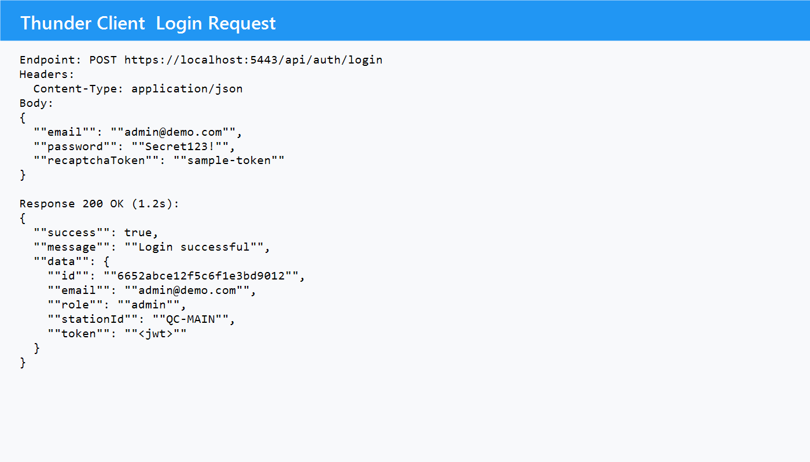

API Documentation
Bukidnon State University
Malaybalay City
College of Technologies
Information Technology Department
Bachelor of Science in Information Technology
1st Semester SY: 2025 – 2026
IT137 – Integrative Programming and Technologies 2
LaundryPOS Omnichannel Management System
API Documentation

# I. Overview

## 1.1 Project Name
LaundryPOS Omnichannel Management System

## 1.2 Client / Respondents of the System
LaundryPOS Franchise Operations Board

## 1.3 Description
The LaundryPOS Omnichannel Management System is a comprehensive, web-based platform designed to help franchise operators manage daily laundry orders and branch payments. This all-inclusive solution strives to reduce human error while offering a user-friendly interface for handling laundry services, pricing, and branch-level transactions. The system guarantees accurate recording and arrangement of operational data pertaining to every branch by providing an intuitive interface. The platform’s capacity to generate digital receipts and invoices is a crucial feature that improves transparency by giving branch managers instant proof of successful payments.

The system incorporates distinct user roles with specific permissions to maintain data integrity and security. Admins are authorized to configure branches, services, employees, and backups, while staff are granted access to create orders, submit expenses, and update customer information. In addition, the franchise owner monitors customers in the system while the platform administrator has the responsibility of maintaining audit logs and backups. This role-based structure ensures that each user can perform designated tasks effectively while maintaining appropriate access controls. Automated notifications further streamline the workflow, reducing manual administrative tasks and providing customers with instant proof of order status. It also generates comprehensive reports on service performance and cashflow for the organization.

The LaundryPOS Management System is designed to improve the overall efficiency of laundry business activities. It offers a comprehensive solution for handling customer orders, classifying various services, keeping an up-to-date database of employees, and communicating payment status clearly via automated receipts. By automating several areas of branch operations, the system considerably minimizes the possibility of human error, which improves record accuracy and increases customer satisfaction. This specialized approach allows branch teams to focus on better servicing clients while ensuring a dependable, user-friendly financial tracking system that keeps every member informed and up to date.

## 1.4 Key Features:
- Secure Login: Utilizes email/username + password with JWT session tokens so only authorized users can log in.
- Error Handling: Implements consistent error objects for validation issues, missing permissions, and expired tokens to enhance troubleshooting.
- Order Management: Allows branches to create drafts, finalize orders, apply discounts, and collect partial payments directly from the Admin or Staff apps.
- Payment Reporting: Generates per-branch reports, sales dashboards, and exportable summaries for finance reviews.
- Receipt Management: Facilitates viewing and emailing of invoices or receipts, with optional PDF attachments for transparency.
- Calendar & Notifications: Integrates pickup schedules, branch announcements, and alert banners so staff never miss deadlines.
- Email Dispatch: Sends automated notifications to customers and franchise owners covering invoices, payment reminders, and approvals.
- Cloud Backups: Provides scheduled and on-demand backups (files and databases) with retention policies managed in the backend.
- Role-Based Access: Enforces RBAC so admins, staff, and auditors only see features appropriate to their roles.
- Archive, Unarchive Records, and Manage Accounts: Archives orders, customers, and employees instead of deleting them to preserve history.
- Secure Logout: Ensures stateless JWT sessions are closed and activity logged after each logout.

## 1.5 Version
1.6.0 – Production

## 1.6 Base URL
http://localhost:5000/api

## 1.7 Authentication
The LaundryPOS Omnichannel Management System uses JWT (JSON Web Token) for secure user authentication. Users supply either an email or username plus password to `/auth/login`, the credentials are validated against the MongoDB user store, and a signed token is returned. Optional safeguards—such as email OTP verification and rate limiting—can be toggled per environment. Password-reset OTPs are delivered through the `/auth/forgot-password` and `/auth/reset-password` endpoints, and all sensitive changes are written to the audit log.

# II. Endpoints
The following are the detailed endpoints of LaundryPOS Omnichannel Management System API. These include HTTP methods used in the API call, parameters, configuration, request, and response of the API.

## 2.1 AUTHENTICATION AND GENERAL MODULE API

### 2.1.1 Module Description
The LaundryPOS authentication module backs both the Admin and Staff apps, covering login, session inspection, password changes, OTP-based resets, and logout. Every sensitive action flows through the JWT middleware (`server/middleware/auth.js`) and RBAC guard (`server/middleware/rbac.js`). The API employs comprehensive response codes: 200 (OK) for successful operations, 201 (Created) for resource creation, 400 (Bad Request) for invalid input, 401 (Unauthorized) for missing or invalid tokens, 403 (Forbidden) for insufficient permissions, 404 (Not Found) for unavailable resources, and 500 (Internal Server Error) for unexpected server issues, ensuring secure and clear communication of request outcomes.

| Method | Path | Description |
| --- | --- | --- |
| POST | `/auth/register` | Bootstrap a user account; typically used by admins only. |
| POST | `/auth/login` | Issue JWT after verifying email/username + password. |
| GET | `/auth/me` | Retrieve the currently authenticated user profile. |
| PUT | `/auth/me` | Update profile details such as email, username, or location. |
| PUT | `/auth/change-password` | Change password while logged in. |
| POST | `/auth/forgot-password` | Send OTP to email for password reset. |
| POST | `/auth/verify-reset-code` | Validate OTP prior to resetting password. |
| POST | `/auth/reset-password` | Replace password using a valid OTP. |
| POST | `/auth/send-verification-code` | Email verification OTP for newly registered users. |
| POST | `/auth/verify-email-code` | Confirm the verification OTP. |
| POST | `/auth/logout` | Record logout event (JWT remains stateless). |
| GET | `/auth/users` | List users with optional role/status filters (admin only). |
| GET | `/auth/profile/:userId` | Fetch arbitrary user profile (admin only). |
| PUT | `/auth/deactivate/:userId` | Disable a user account. |
| PUT | `/auth/activate/:userId` | Reactivate a previously disabled account. |

### Response codes of this API

| Code | Message | Description |
| --- | --- | --- |
| 500 | Internal Server Error | The server encountered an unexpected condition that prevented it from fulfilling the request. |
| 429 | Too Many Request | The client sends too many requests within a certain period. |
| 404 | Not Found | The requested resource could not be found. |
| 403 | Restricted | Invalid token or token expired. |
| 401 | Unauthorized | The request was not successful because it lacks valid authentication credentials. |
| 400 | Bad Request | The request was invalid. |
| 201 | Created | The request was successful, and a new resource has been created. |
| 200 | OK | The request succeeded, and the resource is in the message body. |

### 2.1.1.1 Authenticate User and Create Session
Version: 1.6  
Date: November 26, 2025  
Description: This API endpoint enables the creation of login sessions for secure access to LaundryPOS. Error responses are generated for invalid login attempts, including incorrect credentials or missing parameters. This ensures that only registered users with valid login details can access the system.

Endpoint: `http://localhost:5000/api/auth/login`  
Method: POST

Configurations:
- The API request requires the `Content-Type: application/json` header.
- When reCAPTCHA is enabled, the request must include a valid token in the body.
- Successful logins store device and IP metadata in the audit log.

Parameters:
> `_email` – required if `_username` is not provided; specifies the user’s email.  
> `_username` – required if `_email` is not provided; specifies the user’s username.  
> `_password` – required; user’s password.  
> `_recaptchaToken` – optional; token submitted by the user when reCAPTCHA is enabled.  
> `_rememberMe` – optional; indicates whether the session should remain active longer.  
> `_errorMessage` – optional response field for issues such as “Invalid email or password.”

Requests:
Valid Request  


Not Valid Request  
*(An invalid credential request returns a 401 Unauthorized response with “Invalid email or password.”)*

Response Format: JSON

#### Responses

Success Response
```json
{
  "success": true,
  "message": "Login successful",
  "data": {
    "id": "665aa2f4c81c6d34c1c901ab",
    "email": "admin@laundrypos.com",
    "username": "hq-admin",
    "role": "admin",
    "stationId": "BR-001",
    "token": "<jwt>",
    "expiresIn": 604800
  }
}
```

The success response for this API includes a 200 OK status code and a success message confirming the creation of the user’s login session, allowing access to LaundryPOS. Unauthorized access due to a missing or invalid authentication token triggers a 401 Unauthorized status code with the message “Invalid email or password,” ensuring that secure access policies are enforced.

### 2.1.1.2 Send Password Reset OTP
Version: 1.7  
Date: November 26, 2025  
Description: Sends a six-digit OTP to the user’s registered email so they can reset their password. Used by both Admin and Staff apps through the “Forgot Password” flow.

Endpoint: `http://localhost:5000/api/auth/forgot-password`  
Method: POST

Configurations:
- Rate limited to three attempts per hour per email/IP.  
- Emails are dispatched using the SMTP configuration in `.env`.

Parameters:
> `email` – required; address registered in LaundryPOS.

Requests – Valid Request
```json
{ "email": "admin@laundrypos.com" }
```

Response Format: JSON

Success Response
```json
{
  "success": true,
  "message": "OTP sent to admin@laundrypos.com",
  "data": {
    "expiresInMinutes": 10
  }
}
```

Error Response
```json
{
  "success": false,
  "message": "User not found",
  "error": "AUTH_EMAIL_UNKNOWN"
}
```

### 2.1.1.3 Reset Password with OTP
Version: 1.7  
Date: November 26, 2025  
Description: Validates the OTP generated by `/auth/forgot-password` and updates the user’s password. Expired or mismatched codes return validation errors.

Endpoint: `http://localhost:5000/api/auth/reset-password`  
Method: POST

Configurations:
- Requires a valid OTP that has not expired (default 10 minutes).  
- Password strength is validated on the server before saving.

Parameters:
> `email` – required; must match the OTP request.  
> `code` – required; six-digit OTP.  
> `newPassword` – required; the replacement password meeting policy.

Requests – Valid Request
```json
{
  "email": "admin@laundrypos.com",
  "code": "489215",
  "newPassword": "LaundryPOS!2025"
}
```

Response Format: JSON

Success Response
```json
{
  "success": true,
  "message": "Password reset successful"
}
```

Error Response
```json
{
  "success": false,
  "message": "OTP invalid or expired",
  "error": "AUTH_OTP_INVALID"
}
```

The OTP endpoints return a 200 OK status for successfully validating and resetting a password, confirming the operation’s success. A 401 Unauthorized status indicates a missing or invalid authentication token (when hitting `change-password` while logged in). A 403 Forbidden status signifies that the user lacks sufficient permissions for the request, while a 404 Not Found is returned if the specified email does not exist. For unexpected server issues, a 500 Internal Server Error advises users to retry or seek support. These responses ensure secure, clear, and efficient communication about the request’s outcome.

### 2.1.1.4 Register User
Version: 1.2  
Date: November 26, 2025  
Description: Creates a user account from the Admin console or seed scripts. Typically restricted to admins or automation jobs; not exposed to Staff.

Endpoint: `http://localhost:5000/api/auth/register`  
Method: POST

Configurations:
- Requires an admin JWT token.  
- Validates unique email and username before saving.

Parameters:
> `email` – required unique address.  
> `username` – required unique handle.  
> `password` – required; hashed before saving.  
> `role` – optional (`admin` or `staff`); defaults to `staff`.

Requests
```json
{
  "email": "newstaff@laundrypos.com",
  "username": "qc-branch-staff",
  "password": "Staff@123",
  "role": "staff"
}
```

Response Format: JSON

Responses:
- `201 Created` – Returns newly created user metadata.  
- `409 Conflict` – Email or username already exists.

### 2.1.1.5 Retrieve Current User
Version: 1.3  
Date: November 26, 2025  
Description: Returns the authenticated user’s profile used by both Admin and Staff dashboards on load.

Endpoint: `http://localhost:5000/api/auth/me`  
Method: GET

Configurations:
- Requires a valid JWT token supplied via `Authorization` header.

Response Format: JSON

Success Response
```json
{
  "success": true,
  "data": {
    "id": "665aa2f4c8...",
    "email": "admin@laundrypos.com",
    "username": "hq-admin",
    "role": "admin",
    "stationId": "BR-001"
  }
}
```

### 2.1.1.6 Update Profile
Version: 1.3  
Date: November 26, 2025  
Description: Allows authenticated users to update their own profile details (email, username, contact info).

Endpoint: `http://localhost:5000/api/auth/me`  
Method: PUT

Parameters:
> `email`, `username`, `displayName`, `stationId` – optional fields that can be updated.

Requests
```json
{
  "displayName": "LaundryPOS HQ Admin",
  "stationId": "BR-001"
}
```

Responses:
- `200 OK` – Returns updated profile object.  
- `400 Bad Request` – Invalid email format or duplicate username.

### 2.1.1.7 Change Password (In-session)
Version: 1.4  
Date: November 26, 2025  
Description: Enables logged-in users to change their password by providing the current password.

Endpoint: `http://localhost:5000/api/auth/change-password`  
Method: PUT

Parameters:
> `currentPassword` – required.  
> `newPassword` – required; must meet password policy.

Responses:
- `200 OK` – `"Password updated successfully"`.  
- `401 Unauthorized` – Current password incorrect.

### 2.1.1.8 List Users
Version: 1.5  
Date: November 26, 2025  
Description: Admin-only endpoint returning paginated users with filters by role, status, or station. Used by the Admin Employee table when viewing accounts.

Endpoint: `http://localhost:5000/api/auth/users`  
Method: GET

Configurations:
- Admins can pass query params: `role`, `status`, `stationId`, `search`, `page`, `limit`.

Responses:
- `200 OK` – Returns `{ data: [...], count: 25 }` payload.  
- `403 Forbidden` – User lacks admin privileges.

### 2.1.1.9 Toggle User Access
Version: 1.5  
Date: November 26, 2025  
Description: Enables admins to deactivate or reactivate accounts (used when staff resigns). Both `/auth/deactivate/:userId` and `/auth/activate/:userId` share this structure.

Endpoint: `http://localhost:5000/api/auth/deactivate/:userId` (or `/activate/:userId`)  
Method: PUT

Responses:
- `200 OK` – `"User deactivated"` or `"User activated"`.  
- `404 Not Found` – User ID does not exist.

### 2.1.1.10 Logout
Version: 1.1  
Date: November 26, 2025  
Description: Records a logout event for auditing. JWTs remain stateless, so clients simply drop the token after calling this endpoint.

Endpoint: `http://localhost:5000/api/auth/logout`  
Method: POST

Responses:
- `200 OK` – `"Logout recorded"`.  
- `401 Unauthorized` – Missing or invalid token.

---

# 2.2 ORDERS AND OPERATIONS MODULE API

## 2.2.1 Module Description
The LaundryPOS Orders and Operations Module powers both the Admin Vite web app (`LaundryPos(ADMIN)`) and the Expo Staff app (`LaundryPOS(STAFF)`). It manages draft creation, live order processing, discount application, payment tracking, and email notifications. Staff users are scoped to their assigned `stationId`, while admins can view and override branch assignments. Endpoints enforce edit-locking to prevent concurrent updates, mirroring the workflow in `server/routes/orders.js`.

The API has the following endpoints:
| Method | Path | Description |
| --- | --- | --- |
| GET | `/orders` | List orders with filters (`search`, `payment`, `showArchived`, `showDrafts`). |
| GET | `/orders/:id` | Retrieve an order by friendly ID (e.g., `#ORD-2025-118`). |
| POST | `/orders` | Create or finalize a live order (also converts a draft). |
| POST | `/orders/draft` | Save or update a draft order. |
| PUT | `/orders/:id` | Update order details or payment info. |
| PUT | `/orders/:id/mark-completed` | Mark an order as completed or convert a draft. |
| PUT | `/orders/:id/archive` | Archive the order. |
| PUT | `/orders/:id/unarchive` | Restore an archived order. |
| PUT | `/orders/:id/schedule-deletion` | Flag a draft for scheduled cleanup. |
| DELETE | `/orders/:id` | Permanently delete an order (admin-only safety valve). |
| POST | `/orders/:id/send-email` | Email a PDF invoice/receipt. |
| POST | `/orders/:id/lock` | Acquire an edit lock (Two-Phase Locking implementation). |
| GET | `/orders/:id/lock` | Inspect lock holder and expiry. |
| DELETE | `/orders/:id/lock` | Release an existing lock. |

### Response codes of this API

| Code | Message | Description |
| --- | --- | --- |
| 500 | Internal Server Error | Database or queue disruption while saving orders. |
| 422 | Unprocessable Entity | Missing services, invalid quantities, or expired discounts. |
| 409 | Conflict | Edit lock held by another user or duplicate order reference. |
| 404 | Not Found | Order ID does not exist or has been archived. |
| 403 | Restricted | Staff attempted to access another branch’s order. |
| 201 | Created | Draft or live order created. |
| 200 | OK | Order retrieved, updated, or lock released successfully. |

### 2.2.1.1 Save Draft Order
Version: 2.4  
Date: November 26, 2025  
Description: Saves incomplete tickets from the Staff app autosave and the Admin “Quick Draft” modal. Drafts keep `isDraft` metadata so users can resume editing later.

Endpoint: `http://localhost:5000/api/orders/draft`  
Method: POST

Configurations:
- Requires `orders:create` permission.
- Automatically sets `isDraft: true` and timestamps `updatedAt`.
- Station-scoped; admins may override by including `stationId`.

Parameters:
> `customer` – required object containing `name` and `phone`.  
> `items` – required array of service lines `{ service, quantity, amount }`.  
> `discountId` – optional applied discount reference.  
> `notes`, `pickupDate`, `stationId` – optional metadata stored with the draft.

Requests – Valid Request
```json
{
  "customer": { "name": "Jane Cruz", "phone": "+63-917-111-2222" },
  "items": [
    { "service": "Wash & Fold", "quantity": 5, "amount": 250 }
  ],
  "payment": "Unpaid",
  "stationId": "BR-002",
  "isDraft": true,
  "notes": "Handle silk items separately"
}
```

Response Format: JSON

Success Response
```json
{
  "success": true,
  "message": "Draft saved",
  "data": {
    "draftId": "DRV-2025-118",
    "expiresAt": "2025-11-30T00:00:00Z"
  }
}
```

### 2.2.1.2 Create or Finalize Order
Version: 2.4  
Date: November 26, 2025  
Description: Converts a draft to a live ticket or creates a fresh order from the Admin “Create Order” view. Calculates balances, applies discounts, and pushes notifications used by both Admin and Staff experiences.

Endpoint: `http://localhost:5000/api/orders`  
Method: POST

Configurations:
- Requires `orders:create`.  
- Validates at least one service line and enforces discount rules.  
- When `draftId` is provided, the draft is marked completed and archived automatically.

Parameters:
> `customer`, `items`, `payment`, `paid` – required for every live order.  
> `discountId`, `stationId`, `pickupDate`, `notes`, `draftId` – optional but validated when present.

Requests – Valid Request
```json
{
  "customer": { "name": "Mario Dizon", "phone": "+63-945-555-8899" },
  "items": [
    { "service": "Premium Dry Clean", "quantity": 3, "amount": 450 },
    { "service": "Fold Only", "quantity": 2, "amount": 80 }
  ],
  "discountId": "DISC-BDAY",
  "payment": "Partial",
  "paid": 400,
  "stationId": "BR-001",
  "draftId": "DRV-2025-102",
  "notes": "Deliver before 5 PM"
}
```

Response Format: JSON

Success Response
```json
{
  "success": true,
  "data": {
    "orderId": "#ORD-2025-118",
    "balance": 130,
    "paymentStatus": "Partial",
    "editLock": null
  }
}
```

### 2.2.1.3 Send Invoice Email
Version: 2.0  
Date: November 26, 2025  
Description: Sends a PDF invoice or receipt using the SMTP settings configured in `server/configs`. Used by Admin “Send Email” drawer and Staff share sheet.

Endpoint: `http://localhost:5000/api/orders/:id/send-email`  
Method: POST

Configurations:
- Requires `orders:read`.  
- Falls back to Gmail App Password when SMTP credentials are absent.

Parameters:
> `toEmail` – optional override email; defaults to customer email.  
> `cc`, `subject`, `notes` – optional strings included in the email body.

Requests
```json
{
  "toEmail": "customer@domain.com",
  "subject": "Laundry Invoice #ORD-2025-118",
  "notes": "Pickup scheduled on Nov 28, 5 PM"
}
```

Response Format: JSON

Responses:
- `200 OK` – `"Email sent successfully"`.  
- `500 Internal Server Error` – `"Unable to send invoice email"` when SMTP credentials fail.

### 2.2.1.4 Manage Edit Locks
Version: 1.2  
Date: November 26, 2025  
Description: Implements the two-phase locking rules documented in `docs/server/2PL_CONCURRENCY_CONTROL.md`. Prevents simultaneous editing between Admin (React) and Staff (Expo) clients.

Endpoints: `POST /api/orders/:id/lock`, `GET /api/orders/:id/lock`, `DELETE /api/orders/:id/lock`

Configurations:
- Lock duration defaults to 60 seconds; extend by passing `expiresInMs`.  
- Unlocking requires the same user or an admin override.

Responses:
- `201 Created` – lock acquired.  
- `200 OK` – lock inspected or released.  
- `409 Conflict` – `"Order currently locked by staff-102"`.

### 2.2.1.5 List Orders
Version: 2.2  
Date: November 26, 2025  
Description: Returns paginated orders for dashboards and search experiences in Admin and Staff apps.

Endpoint: `http://localhost:5000/api/orders`  
Method: GET

Configurations:
- Supports query params: `search`, `payment`, `showArchived`, `showDrafts`, `stationId`, `page`, `limit`.

Responses:
- `200 OK` – `{ success: true, data: [...], count: 120 }`.  
- `403 Forbidden` – Staff attempted to list another branch’s orders.

### 2.2.1.6 Retrieve Order by ID
Version: 2.2  
Date: November 26, 2025  
Description: Fetches a single order using the human-friendly ID or ObjectID, used by the Admin order drawer.

Endpoint: `http://localhost:5000/api/orders/:id`  
Method: GET

Responses:
- `200 OK` – Returns order metadata, items, payments, and notes.  
- `404 Not Found` – Order is missing or archived with `showArchived=false`.

### 2.2.1.7 Update Order or Payment
Version: 2.3  
Date: November 26, 2025  
Description: Allows admins/staff (with permission) to edit order details, payment info, or notes.

Endpoint: `http://localhost:5000/api/orders/:id`  
Method: PUT

Requests
```json
{
  "payment": "Partial",
  "paid": 500,
  "notes": "Customer paid extra 200 upon pickup"
}
```

Responses:
- `200 OK` – Updated order returned.  
- `409 Conflict` – Attempted update while lock held by another user.

### 2.2.1.8 Mark Order Completed
Version: 2.1  
Date: November 26, 2025  
Description: Converts drafts to active orders or marks active orders as completed, freeing up edit locks.

Endpoint: `http://localhost:5000/api/orders/:id/mark-completed`  
Method: PUT

Responses:
- `200 OK` – `"Order marked completed"`.  
- `404 Not Found` – Draft ID invalid.

### 2.2.1.9 Archive / Unarchive Order
Version: 2.0  
Date: November 26, 2025  
Description: Soft deletes orders to keep history intact while hiding them from default lists.

Endpoints: `PUT /api/orders/:id/archive`, `PUT /api/orders/:id/unarchive`  
Method: PUT

Responses:
- `200 OK` – `"Order archived"` or `"Order restored"`.  
- `404 Not Found` – Order ID missing.

### 2.2.1.10 Schedule Draft Deletion
Version: 1.8  
Date: November 26, 2025  
Description: Flags stale drafts for auto-purge by the nightly cron job.

Endpoint: `http://localhost:5000/api/orders/:id/schedule-deletion`  
Method: PUT

Parameters:
> `scheduledDeleteAt` – required ISO date/time for deletion.

Responses:
- `200 OK` – `"Draft scheduled for deletion"`.  
- `404 Not Found` – Draft ID missing or already deleted.

### 2.2.1.11 Delete Order (Hard Delete)
Version: 1.1  
Date: November 26, 2025  
Description: Permanently removes an order. Restricted to super-admin troubleshooting scenarios.

Endpoint: `http://localhost:5000/api/orders/:id`  
Method: DELETE

Responses:
- `200 OK` – `"Order removed"` along with audit log entry.  
- `403 Forbidden` – User lacks `orders:delete`.  
- `404 Not Found` – Order already deleted.

---

# 2.3 CUSTOMER MANAGEMENT MODULE API

## 2.3.1 Module Description
The Customer module is consumed by both applications for CRM lookups, loyalty metrics, and auto-complete lists. Staff users (`LaundryPOS(STAFF)`) can only manage customers tied to their station, while Admin users (`LaundryPos(ADMIN)`) have full access. Records are archived instead of deleted to preserve historical invoices.

| Method | Path | Description |
| --- | --- | --- |
| GET | `/customers` | List customers with query filters (`search`, `sortBy`, `showArchived`). |
| GET | `/customers/:id` | Retrieve a specific customer profile. |
| POST | `/customers` | Create a customer from Admin or Staff input. |
| PUT | `/customers/:id` | Update customer details. |
| PUT | `/customers/:id/archive` | Archive a customer instead of deleting. |
| PUT | `/customers/:id/unarchive` | Restore an archived customer. |
| DELETE | `/customers/:id` | Hard delete (reserved for admins/auditors). |

### Response codes of this API

| Code | Message | Description |
| --- | --- | --- |
| 500 | Internal Server Error | Customer document failed to save. |
| 409 | Conflict | Duplicate phone or email detected. |
| 404 | Not Found | Customer ID absent or filtered by `showArchived=false`. |
| 403 | Restricted | Staff attempted to access another branch’s customer. |
| 201 | Created | Customer profile saved. |
| 200 | OK | Customer retrieved or updated. |

### 2.3.1.1 List Customers
Version: 1.8  
Date: November 26, 2025  
Description: Returns paginated customers with search, sorting, and archive filters for Admin CRM dashboards.

Endpoint: `http://localhost:5000/api/customers`  
Method: GET

Configurations:
- Query params: `search`, `sortBy`, `showArchived`, `stationId`, `page`, `limit`.

Responses:
- `200 OK` – `{ success: true, data: [...], count: 90 }`.  
- `403 Forbidden` – Staff attempted to view another station’s customers.

### 2.3.1.2 Create Customer Profile
Version: 1.9  
Date: November 26, 2025  
Description: Creates a reusable customer profile from the Admin “Add Customer” modal or Staff quick-registration sheet.

Endpoint: `http://localhost:5000/api/customers`  
Method: POST

Configurations:
- Requires `customers:create`.  
- Phone numbers are validated and normalized.

Parameters:
> `name`, `phone` – required.  
> `email`, `notes`, `stationId` – optional fields stored with the profile.

Success Response
```json
{
  "success": true,
  "data": {
    "_id": "CUS-665aa2f4c8",
    "name": "Lara Santos",
    "phone": "+63-900-777-0000",
    "stationId": "BR-001"
  }
}
```

### 2.3.1.3 Update Customer Details
Version: 1.9  
Date: November 26, 2025  
Description: Allows staff/admins to edit customer contact info, loyalty notes, or assigned station.

Endpoint: `http://localhost:5000/api/customers/:id`  
Method: PUT

Requests
```json
{
  "email": "lara-updated@example.com",
  "notes": "VIP customer, prefers morning pickup"
}
```

Responses:
- `200 OK` – Updated customer returned.  
- `404 Not Found` – Customer ID missing.

### 2.3.1.4 Archive or Unarchive Customer
Version: 1.4  
Date: November 26, 2025  
Description: Archives customers when accounts go inactive, keeping invoices intact for reporting. Admins can restore archived customers if they return.

Endpoints: `PUT /api/customers/:id/archive`, `PUT /api/customers/:id/unarchive`  
Responses: `200 OK` with `"message": "Customer archived"` or `"Customer restored"`; `404 Not Found` when the ID does not exist.

### 2.3.1.5 Delete Customer (Hard Delete)
Version: 1.2  
Date: November 26, 2025  
Description: Removes a customer entirely. Reserved for data correction scenarios and limited to admins.

Endpoint: `http://localhost:5000/api/customers/:id`  
Method: DELETE

Responses:
- `200 OK` – `"Customer deleted"` plus audit entry.  
- `403 Forbidden` – Lack of `customers:delete`.  
- `404 Not Found` – ID missing.

---

# 2.4 SERVICES AND DISCOUNT MODULE API

## 2.4.1 Module Description
This module synchronizes with the Admin catalog designer (`LaundryPos(ADMIN)/src/pages/Services`) and Staff pricing lookups. Services include category, price, and unit, while discounts enforce activation windows and usage limits. All changes are audited in `server/middleware/auditLogger.js`.

| Method | Path | Description |
| --- | --- | --- |
| GET | `/services` | List services (supports `includeArchived`). |
| GET | `/services/:id` | Retrieve a service definition. |
| POST | `/services` | Create a service (name, category, price, unit, description). |
| PUT | `/services/:id` | Update service fields. |
| PUT | `/services/:id/archive` | Archive a service. |
| PUT | `/services/:id/unarchive` | Restore a service. |

Discount-specific endpoints:  
`GET /discounts` • `GET /discounts/:id` • `POST /discounts` • `PUT /discounts/:id` • `PUT /discounts/:id/archive` • `PUT /discounts/:id/unarchive` • `PUT /discounts/:id/reset-usage`

### Response codes of this API

| Code | Message | Description |
| --- | --- | --- |
| 500 | Internal Server Error | Catalog database operation failed. |
| 422 | Unprocessable Entity | Invalid percentage value or inactive validity window. |
| 201 | Created | Service/discount created. |
| 200 | OK | Catalog item retrieved or updated. |

### 2.4.1.1 Create Laundry Service
Version: 2.0  
Date: November 26, 2025  
Description: Adds a service (e.g., Wash & Fold, Premium Dry Clean) available to all stations or a specific branch.

Endpoint: `http://localhost:5000/api/services`  
Method: POST

Parameters:
> `name`, `category`, `price`, `unit` – required.  
> `description`, `isPopular` – optional.

Responses:
- `201 Created` – Returns service details.  
- `409 Conflict` – Duplicate service name in same category.

### 2.4.1.2 Update Service
Version: 2.0  
Date: November 26, 2025  
Description: Edits pricing, unit, or description when costs change.

Endpoint: `http://localhost:5000/api/services/:id`  
Method: PUT

Responses:
- `200 OK` – Updated service returned.  
- `404 Not Found` – Service ID missing.

### 2.4.1.3 Archive / Unarchive Service
Version: 1.7  
Date: November 26, 2025  
Description: Toggles service visibility without losing history.

Endpoints: `PUT /api/services/:id/archive`, `PUT /api/services/:id/unarchive`  
Method: PUT

Responses: `200 OK` when status toggled; `404 Not Found` when ID invalid.

### 2.4.1.4 Create Discount
Version: 1.8  
Date: November 26, 2025  
Description: Defines promo codes (percentage or fixed) with validity windows and usage caps.

Endpoint: `http://localhost:5000/api/discounts`  
Method: POST

Parameters:
> `code`, `name`, `type`, `value`, `validFrom`, `validTo`, `maxUsage`.

Responses:
- `201 Created` – Discount saved.  
- `422 Unprocessable Entity` – Value outside allowed range.

### 2.4.1.5 Reset Discount Usage
Version: 1.5  
Date: November 26, 2025  
Description: Resets `usageCount` to zero for campaigns that need to restart.

Endpoint: `http://localhost:5000/api/discounts/:id/reset-usage`  
Method: PUT

Responses:
- `200 OK` – `"Usage reset"` message.  
- `404 Not Found` – Discount ID missing.

---

# 2.5 EMPLOYEES AND RBAC MODULE API

## 2.5.1 Module Description
These endpoints power the Admin employee roster and the server’s RBAC middleware (`server/middleware/rbac.js`). Admins can onboard new staff, toggle login access, and update permission matrices. Staff accounts are used by the Expo app for authentication.

| Method | Path | Description |
| --- | --- | --- |
| GET | `/employees` | List employees with filters (`search`, `role`, `status`, `stationId`). |
| GET | `/employees/:id` | Retrieve employee profile. |
| GET | `/employees/:id/performance` | Aggregated KPIs (orders handled, sales, etc.). |
| POST | `/employees` | Onboard a new employee (admin only). |
| PUT | `/employees/:id` | Update employee details. |
| PUT | `/employees/:id/toggle-account` | Enable or disable login access. |
| PUT | `/employees/:id/archive` | Archive employee record. |
| PUT | `/employees/:id/unarchive` | Restore an employee. |

RBAC endpoints:  
`GET /rbac/resources` • `GET /rbac` • `GET /rbac/:role` • `PUT /rbac/:role` • `PUT /rbac/:role/reset` • `POST /rbac/initialize`

### Response codes of this API

| Code | Message | Description |
| --- | --- | --- |
| 500 | Internal Server Error | Unable to save employee or RBAC changes. |
| 404 | Not Found | Employee ID missing. |
| 403 | Restricted | Caller lacks admin permissions. |
| 201 | Created | Employee profile created. |
| 200 | OK | Employee or RBAC update succeeded. |

### 2.5.1.1 Onboard Employee
Version: 1.6  
Date: November 26, 2025  
Description: Creates an employee record and pairs it with a login account. Used by Admin HR workflows.

Endpoint: `http://localhost:5000/api/employees`  
Method: POST

Parameters include `fullName`, `email`, `phone`, `role`, `stationId`, `salary`, `hireDate`, `permissions`.

Responses:
- `201 Created` – Employee profile returned.  
- `409 Conflict` – Email already assigned.

### 2.5.1.2 Update Employee / Performance Notes
Version: 1.6  
Date: November 26, 2025  
Description: Edits general info or branch assignment.

Endpoint: `http://localhost:5000/api/employees/:id`  
Method: PUT

Responses:
- `200 OK` – Updated employee object.  
- `404 Not Found` – Employee missing.

### 2.5.1.3 Toggle Employee Account
Version: 1.5  
Date: November 26, 2025  
Description: Enables or disables login access without deleting the profile; used when staff go on leave.

Endpoint: `http://localhost:5000/api/employees/:id/toggle-account`  
Method: PUT

Responses:
- `200 OK` – `"Account disabled"` or `"Account enabled"`.  
- `404 Not Found` – Employee ID missing.

### 2.5.1.4 Archive / Unarchive Employee
Version: 1.4  
Date: November 26, 2025  
Description: Archives employees while keeping payroll and audit history.

Endpoints: `PUT /api/employees/:id/archive`, `PUT /api/employees/:id/unarchive`  
Method: PUT

Responses: `200 OK` toggles status; `404 Not Found` when ID invalid.

### 2.5.1.5 Manage RBAC Permissions
Version: 1.3  
Date: November 26, 2025  
Description: Lists and customizes role-to-permission maps stored in the RBAC collection.

Endpoints:  
`GET /rbac/resources` – Inspect manageable resources/actions.  
`GET /rbac/:role` – View a role’s permissions.  
`PUT /rbac/:role` – Update permission map.  
`PUT /rbac/:role/reset` – Reset to defaults.  
`POST /rbac/initialize` – Bootstrap baseline roles.

Responses:
- `200 OK` – Permissions payload returned.  
- `403 Forbidden` – Caller lacks admin privileges.

---

# 2.6 EXPENSES AND FINANCE MODULE API

## 2.6.1 Module Description
Staff tablets submit expenses for approvals, while Admin reviewers respond via the Expenses dashboard. Endpoints implement the approval workflow, receipt uploads (Cloudinary), finance feedback, and archival actions.

| Method | Path | Description |
| --- | --- | --- |
| GET | `/expenses` | List expenses (`search`, `status`, `category`, `showArchived`). |
| GET | `/expenses/:id` | Retrieve a single expense request. |
| POST | `/expenses` | Submit expense draft `{ title, amount, category, receiptUrl?, notes? }`. |
| PUT | `/expenses/:id` | Update expense while pending. |
| PUT | `/expenses/:id/approve` | Approve and optionally add remarks. |
| PUT | `/expenses/:id/reject` | Reject with required reason. |
| PUT | `/expenses/:id/feedback` | Finance feedback/clarifications. |
| PUT | `/expenses/:id/receipt` | Upload/update receipt metadata. |
| PUT | `/expenses/:id/appeal` | Submit additional documentation for rejected expenses. |
| PUT | `/expenses/:id/archive` | Archive an expense. |
| PUT | `/expenses/:id/unarchive` | Restore an archived expense. |

### Response codes of this API

| Code | Message | Description |
| --- | --- | --- |
| 500 | Internal Server Error | Cloudinary upload or DB update failed. |
| 422 | Unprocessable Entity | Amount below minimum or missing receipt. |
| 404 | Not Found | Expense ID missing. |
| 403 | Restricted | User lacks finance approval permission. |
| 201 | Created | Expense submitted. |
| 200 | OK | Expense updated, approved, or archived. |

### 2.6.1.1 Submit Expense Request
Version: 1.5  
Date: November 26, 2025  
Description: Staff members use this endpoint to file reimbursements or operational expenses.

Endpoint: `http://localhost:5000/api/expenses`  
Method: POST

Parameters:
> `title`, `amount`, `category` – required.  
> `receiptUrl`, `notes`, `stationId` – optional.

Responses:
- `201 Created` – Returns pending expense with tracking ID.  
- `422 Unprocessable Entity` – Amount missing or below allowed minimum.

### 2.6.1.2 Approve Expense
Version: 1.4  
Date: November 26, 2025  
Description: Finance admins approve expenses and optionally add remarks.

Endpoint: `http://localhost:5000/api/expenses/:id/approve`  
Method: PUT

Responses:
- `200 OK` – `"Expense approved"` plus approval metadata.  
- `403 Forbidden` – Caller lacks approval permission.

### 2.6.1.3 Reject Expense
Version: 1.4  
Date: November 26, 2025  
Description: Rejects an expense with a required reason so the requester can adjust.

Endpoint: `http://localhost:5000/api/expenses/:id/reject`  
Method: PUT

Parameters:
> `reason` – required text describing why the request was rejected.

Responses:
- `200 OK` – `"Expense rejected"` message.  
- `400 Bad Request` – Missing reason.

### 2.6.1.4 Upload Receipt
Version: 1.3  
Date: November 26, 2025  
Description: Attaches or replaces receipt metadata/Cloudinary URL after approval.

Endpoint: `http://localhost:5000/api/expenses/:id/receipt`  
Method: PUT

Parameters:
> `receiptUrl`, `receiptNumber`, `receiptDate`.

Responses:
- `200 OK` – Expense returned with updated receipt info.  
- `404 Not Found` – Expense ID missing.

### 2.6.1.5 Archive / Unarchive Expense
Version: 1.2  
Date: November 26, 2025  
Description: Hides completed expenses while keeping historical data.

Endpoints: `PUT /api/expenses/:id/archive`, `PUT /api/expenses/:id/unarchive`  
Method: PUT

Responses: `200 OK` toggles archive state; `404 Not Found` when ID invalid.

---

# 2.7 STATIONS, REPORTS, NOTIFICATIONS, SUPPORT, AND SYSTEM UTILITIES

## 2.7.1 Module Description
This module exposes shared infrastructure endpoints for branch metadata, dashboards, reports, notifications, backups, uploads, and support tickets. The Admin app’s Branch Management page and the marketing landing page (`landing-page/src`) both consume `/api/stations` endpoints, while cron jobs trigger `/api/backups`.

### Branch / Station Endpoints

| Method | Path | Description |
| --- | --- | --- |
| GET | `/stations/public` | Public branch list shown on the marketing site. |
| GET | `/stations` | Authenticated branch list with filters (`search`, `status`). |
| GET | `/stations/:id` | Retrieve branch details. |
| POST | `/stations` | Create a branch (admin only). |
| PUT | `/stations/:id` | Update branch metadata. |
| PUT | `/stations/:id/archive` | Archive branch. |
| PUT | `/stations/:id/unarchive` | Restore branch. |
| DELETE | `/stations/:id` | Hard delete branch (rare). |

### Reports & Dashboard

| Method | Path | Description |
| --- | --- | --- |
| GET | `/dashboard/stats` | Aggregated KPIs for Admin home. |
| POST | `/reports/orders` | Generate order report given filters/date range. |
| POST | `/reports/revenue` | Generate revenue report (JSON/PDF/Excel). |
| POST | `/reports/customers` | Customer activity report. |
| POST | `/reports/services` | Service utilization report. |
| POST | `/reports/expenses` | Expense tracking report. |
| POST | `/reports/employee` | Employee performance report. |
| POST | `/reports/sales-per-branch` | Branch comparison report. |
| POST | `/reports/cashflow-per-branch` | Cashflow summary per branch. |

### Notifications

| Method | Path | Description |
| --- | --- | --- |
| GET | `/notifications` | Paginated notifications for the logged-in user. |
| GET | `/notifications/stream` | Server-Sent Events stream for real-time updates. |
| PUT | `/notifications/:notificationId/read` | Mark a single notification as read. |
| PUT | `/notifications/read-all` | Mark all notifications as read. |

### Backups & Recovery

| Method | Path | Description |
| --- | --- | --- |
| POST | `/backups` | Trigger a manual backup (files + database). |
| GET | `/backups` | List available backups with metadata. |
| GET | `/backups/stats` | Summary of stored backups and disk usage. |
| POST | `/backups/:backupName/restore` | Restore environment from backup. |
| DELETE | `/backups/:backupName` | Remove backup file. |
| POST | `/backups/cleanup` | Run retention and cleanup rules. |

### Uploads

| Method | Path | Description |
| --- | --- | --- |
| POST | `/upload/image` | Upload a single base64 image (used for receipts/profile pics). |
| POST | `/upload/images` | Batch upload multiple base64 images. |

### Support & Feedback

| Method | Path | Description |
| --- | --- | --- |
| POST | `/support/feedback` | Submit feature requests or incident reports to the ops team. |

### System Health & Settings

| Method | Path | Description |
| --- | --- | --- |
| GET | `/system-settings/inactivity` | Fetch auto-logout configuration. |
| PUT | `/system-settings/inactivity` | Update timeout configuration. |
| GET | `/health` | Returns server uptime, DB connectivity, and version info. |

### Audit Logs

| Method | Path | Description |
| --- | --- | --- |
| GET | `/audit-logs` | Search audit entries (supports filters and pagination). |
| GET | `/audit-logs/stats` | Aggregated stats of audit actions. |
| GET | `/audit-logs/:id` | Retrieve a specific audit entry. |

### 2.7.1.1 List Branches (Admin)
Version: 1.6  
Date: November 26, 2025  
Description: Lists branch/station records with filters and pagination for the Admin branch management view.

Endpoint: `http://localhost:5000/api/stations`  
Method: GET

Parameters: `search`, `status`, `page`, `limit`.

Responses:
- `200 OK` – Returns branch array.  
- `403 Forbidden` – Non-admin request.

### 2.7.1.2 Create Branch
Version: 1.6  
Date: November 26, 2025  
Description: Adds a station to the network and seeds default services.

Endpoint: `http://localhost:5000/api/stations`  
Method: POST

Parameters: `name`, `code`, `address`, `contact`, `status`.

Responses:
- `201 Created` – Branch object.  
- `409 Conflict` – Duplicate code detected.

### 2.7.1.3 Generate Revenue Report
Version: 1.4  
Date: November 26, 2025  
Description: Produces revenue summaries for the Admin reporting page and exports to JSON/PDF/Excel.

Endpoint: `http://localhost:5000/api/reports/revenue`  
Method: POST

Requests
```json
{
  "dateRange": { "from": "2025-11-01", "to": "2025-11-30" },
  "stations": ["BR-001", "BR-003"],
  "format": "json",
  "groupBy": "week"
}
```

Responses:
- `200 OK` – Aggregated metrics or binary export stream.  
- `202 Accepted` – Report enqueued for async processing.

### 2.7.1.4 Trigger Manual Backup
Version: 1.3  
Date: November 26, 2025  
Description: Initiates an immediate backup stored under `/server/backups`.

Endpoint: `http://localhost:5000/api/backups`  
Method: POST

Responses:
- `200 OK` – Returns backup metadata and download link.  
- `500 Internal Server Error` – Disk/compression failure.

### 2.7.1.5 Upload Image
Version: 1.2  
Date: November 26, 2025  
Description: Accepts base64 images for receipts, avatars, or service thumbnails.

Endpoint: `http://localhost:5000/api/upload/image`  
Method: POST

Parameters:
> `image` – base64 string.  
> `fileName` – optional custom name.

Responses:
- `200 OK` – Returns CDN URL.  
- `413 Payload Too Large` – File exceeds limit.

### 2.7.1.6 Submit Support Feedback
Version: 1.1  
Date: November 26, 2025  
Description: Sends feature requests or incident reports to the internal ops inbox.

Endpoint: `http://localhost:5000/api/support/feedback`  
Method: POST

Parameters: `title`, `description`, `feedbackType`, `reporterEmail`, `reporterPhone`.

Responses:
- `200 OK` – `"Feedback sent"` with tracking ID.  
- `500 Internal Server Error` – Email/SMS dispatch failure.

### 2.7.1.7 Health Check
Version: 1.0  
Date: November 26, 2025  
Description: Used by deployment probes to verify uptime and DB connectivity.

Endpoint: `http://localhost:5000/api/health`  
Method: GET

Responses:
- `200 OK` – `{ status: "healthy", uptime: "...", db: "connected" }`.  
- `500 Internal Server Error` – Contains diagnostic hints when dependencies fail.

---

# III. Authentication Requirements
1. Every protected endpoint must include the `Authorization: Bearer <token>` header.  
2. JWT tokens expire after seven days by default; enabling `rememberMe` extends the session to thirty days.  
3. Accounts are locked for two hours after five failed login attempts.  
4. OTP codes expire after ten minutes and are limited to three requests per hour.  
5. `POST /auth/logout` records the logout event; disabling the user account is required to fully revoke stateless tokens.

# IV. Error Handling

| Status | Meaning | Typical Cause |
| --- | --- | --- |
| 200 | OK | Request processed successfully |
| 201 | Created | Resource generated (user, OTP, reset entry) |
| 400 | Bad Request | Missing required fields or malformed JSON |
| 401 | Unauthorized | Missing/invalid token or incorrect credentials |
| 403 | Forbidden | Role lacks permission to access the resource |
| 404 | Not Found | Resource not available (profile/email mismatch) |
| 409 | Conflict | Duplicate user, locked account, or reused OTP |
| 422 | Unprocessable Entity | OTP expired or password policy violation |
| 429 | Too Many Requests | Rate limit triggered for login/OTP |
| 500 | Internal Server Error | Unexpected error (database outage, service failure) |

# V. Sample Requests and Responses
1. **Login:** Use the payload and screenshot shown in Section 2.1.1.1.  
2. **Send Reset OTP:** Follow the `/auth/forgot-password` request in Section 2.1.1.2.  
3. **Reset Password:** Submit the payload in Section 2.1.1.3 to `/auth/reset-password`.  
4. **Draft Order:** Use the Staff autosave payload from Section 2.2.1.1.  
5. **Email Invoice:** Call `/orders/:id/send-email` as detailed in Section 2.2.1.3.

# VI. Security Notes
- All passwords are hashed with bcrypt (12 salt rounds).  
- Environment variables required: `JWT_SECRET`, `MONGODB_URI`, SMTP credentials, reCAPTCHA keys, and `ALLOWED_ORIGINS`.  
- HTTPS should be enforced in production using certificates stored in `server/certs/`.  
- Audit logs capture user, IP, user-agent, and payload metadata for every sensitive endpoint.  
- Rate limiting is enforced via `middleware/rateLimiter.js` to protect authentication workflows.

# VII. Changelog
| Date | Change |
| --- | --- |
| 26 Nov 2025 | Reformatted documentation to mirror the BukSU template and embedded Thunder Client evidence. |
| 15 Nov 2025 | Added OTP verification, password reset, and logout coverage. |

# VIII. References
- LaundryPOS backend source (`server/routes`, `server/controllers`)  
- Internal API Reference (`docs/API_REFERENCE.md`)  
- Thunder Client captures stored under `docs/images/`  
- SBO Fee Collection Management System API Documentation (Sample PDF)  
- `API Documentation Rubric.docx`

# IX. Submission Checklist
- [x] Followed template sections (Overview → Endpoints → Error Handling → Changelog).  
- [x] Matched subsection phrasing and tables from the provided sample.  
- [x] Included authentication description, response codes, and screenshots.  
- [x] Documented changelog and references.  
- [x] Exported as PDF (`LaundryPOS_API Documentation.pdf`, A4).

